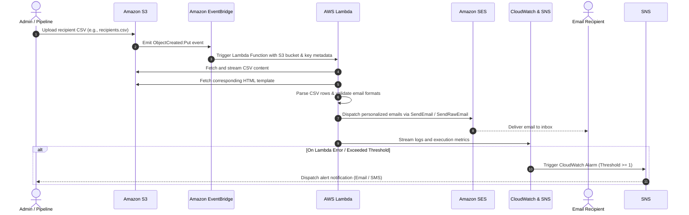

# AWS-Project-04: MailMatrix - Serverless Bulk Email Notification & Dispatch System

[](https://aws.amazon.com/)
[](https://aws.amazon.com/lambda/)
[](https://aws.amazon.com/s3/)
[](https://aws.amazon.com/ses/)
[](https://aws.amazon.com/cloudwatch/)
[](./LICENSE)

---

## 📌 Overview

**MailMatrix** is an event-driven, production-ready bulk email dispatch system built on top of AWS serverless architecture. The system enables users and automated workflows to upload CSV files with recipient details into an Amazon S3 bucket, automatically triggers an AWS Lambda processing engine via Amazon EventBridge, personalizes email templates (HTML/plain text), and dispatches high-deliverability emails through Amazon Simple Email Service (SES).

The architecture is equipped with end-to-end monitoring via **Amazon CloudWatch** and **Amazon SNS** alarms, comprehensive role-based access control with **AWS IAM**, and Infrastructure as Code (IaC) deployment templates using **AWS CloudFormation**.

---

## 🎯 Architecture & System Design

The diagram below outlines the event-driven data flow and service interactions within the MailMatrix system:


### Component Breakdown

| Service | Role in MailMatrix |
| :--- | :--- |
| **Amazon S3** | Ingests recipient CSV files and stores reusable HTML templates (`welcome_email.html`, `rejection_email.html`). |
| **Amazon EventBridge** | Detects S3 bucket state changes (`PutObject`, `DeleteObject`) via CloudTrail/S3 Event Notifications and routes them to AWS Lambda. |
| **AWS Lambda** | Serverless compute layer executing CSV parsing, email validation, Jinja2 template rendering, and SES API dispatching. |
| **Amazon SES** | Enterprise-grade Simple Email Service handling transactional and bulk email delivery with reputation monitoring. |
| **Amazon CloudWatch** | Aggregates execution logs, tracks invocation/error metrics, and monitors Lambda health. |
| **Amazon SNS** | Subscribes to CloudWatch alarms to instantly notify system administrators via Email or SMS upon pipeline failures. |
| **AWS IAM** | Enforces the principle of least privilege through dedicated Lambda execution roles and resource policies. |

---

## 🔄 End-to-End Workflow




1. **File Ingestion:** The administrator uploads a recipient CSV file to the designated S3 bucket.
2. **Event Trigger:** An S3 event is emitted and captured by EventBridge (or direct S3 event notification), invoking the Lambda worker.
3. **Data Parsing & Sanitization:** Lambda reads the file object from S3, iterates through the recipient rows, and validates all email addresses against regex format rules.
4. **Dynamic Personalization:** The email template is populated with dynamic placeholders (e.g., `name`, `status`, custom data) using Jinja2 or string substitution.
5. **Dispatch:** Emails are routed to Amazon SES.
6. **Telemetry & Failure Detection:** Every invocation is monitored in CloudWatch. If errors exceed the allowed threshold, an SNS alarm alert is sent immediately.

---

## 📂 Repository Structure

```bash
AWS-Project-04/
├── README.md                                                     # Project documentation and deployment guide
└── MailMatrix-Stream-Cloud-Enhanced-Bulk-Email-Dispatch-System/
    ├── architecture.pdf                                          # PDF schematic of the system architecture
    ├── proj_2workflow.pdf                                        # Workflow documentation
    ├── requirements.txt                                          # Python requirements (boto3, jinja2)
    ├── package.json                                              # Optional web UI frontend package definition
    ├── Mailmatrix-stream/                                        # Cloud deployment resources
    │   ├── lambda/
    │   │   ├── lambda_function.py                               # Unified handler for S3 Put/Delete events
    │   │   ├── fileUploadHandler.py                              # Specialized handler for CSV creation events
    │   │   └── fileDeletehandler.py                              # Specialized handler for object deletion events
    │   └── templates/
    │       ├── mailmatrix-stream-cloudformation.yaml             # Complete CloudFormation infrastructure template
    │       ├── welcome_email.html                                # HTML template for welcome notifications
    │       └── rejection_email.html                              # HTML template for status updates
    └── local_build/                                              # Standalone local development & CLI utility
        ├── data/
        │   ├── recipients.csv                                    # Sample recipient dataset
        │   └── templates/
        │       └── welcome_email.html                            # Local sample HTML template
        ├── docs/
        │   ├── proj#2-architecture.pdf                           # Local architecture design spec
        │   └── proj#2-architecture.png                           # Architecture diagram image
        └── src/
            ├── email_sender.py                                   # Local SES dispatcher script
            ├── cli/
            │   └── cli_tool.py                                   # Command-line interface for manual email dispatches
            └── core/
                ├── data_manager.py                               # CSV reader and validator
                └── template_manager.py                           # Jinja2 template loader
```

---

## 🚀 Step-by-Step Implementation Guide

### Prerequisites

Before deploying the project, ensure you have:
- An active **AWS Account** with administrative or sufficient permissions (`s3:*`, `lambda:*`, `ses:*`, `iam:*`, `cloudwatch:*`, `sns:*`, `events:*`).
- **AWS CLI** installed and configured locally (`aws configure`).
- A verified email address or verified domain in **Amazon SES** (e.g., `verified-sender@example.com`).
- Python 3.10+ installed locally for local testing.

---

### Step 1: Configure Amazon S3 Bucket

1. Open the **Amazon S3 Console** and click **Create bucket**.
2. Set a globally unique bucket name (e.g., `mailmatrix-stream-storage-<account-id>`).
3. Select your preferred AWS Region (e.g., `us-east-1` or `ap-south-1`).
4. Enable **Bucket Versioning** and enforce **Server-Side Encryption (SSE-S3 or KMS)**.

#### Console Walkthrough:
* **Step 1A — Bucket Configuration:** Enter the unique bucket name and select the desired AWS Region.  
  

* **Step 1B — Encryption & Security Settings:** Enable default server-side encryption to safeguard uploaded recipient data at rest.  
  

* **Step 1C — Bucket Verification:** Confirm the bucket status is Active in the S3 Dashboard.  
  

---

### Step 2: Configure Amazon SES (Simple Email Service)

1. Navigate to **Amazon SES Console** > **Configuration** > **Identities**.
2. Click **Create identity**.
3. Choose **Email address** (for sandbox testing) or **Domain** (for production environments).
4. Enter your email (e.g., `sender@yourdomain.com`) and complete verification by clicking the confirmation link sent by AWS.

> [!NOTE]
> In the SES **Sandbox** environment, you must verify both the **sender** and **recipient** email addresses. Once you move to **Production**, you can send emails to any recipient.


---

### Step 3: Configure IAM Roles & Least-Privilege Policies

The Lambda function requires an IAM execution role with permissions to read from S3, send emails via SES, and write logs to CloudWatch.

#### Console Walkthrough:
* **Step 3A — Role Creation:** Create a service role with AWS Lambda as the trusted entity.  
  

* **Step 3B — S3 & Logging Policies:** Attach `AWSLambdaBasicExecutionRole` and custom S3 read policies.  
  

* **Step 3C — SES Permissions:** Add `ses:SendEmail` and `ses:SendRawEmail` permissions scoped to your verified SES identity ARN.  
  

* **Step 3D — Trigger Execution Trust:** Ensure EventBridge / S3 has trust permissions to invoke the target Lambda function.  
  

---

### Step 4: Deploy the AWS Lambda Dispatch Engine

1. Go to **AWS Lambda Console** > **Create function**.
2. Select **Author from scratch**, set the runtime to **Python 3.11** or **Python 3.12**, and attach the IAM execution role created in Step 3.
3. Deploy the function code from `Mailmatrix-stream/lambda/lambda_function.py`.
4. Configure the environment variables:
   - `SENDER_EMAIL`: Your verified SES identity address (e.g., `sender@yourdomain.com`).
   - `AWS_REGION`: Target AWS region (e.g., `us-east-1` or `ap-south-1`).
5. Adjust function timeout to `300 seconds` (5 minutes) to accommodate batch email processing.
6. Add an **S3 Event Trigger** (or EventBridge rule) for `s3:ObjectCreated:*` and `s3:ObjectRemoved:*`.

#### Console Walkthrough:
* **Step 4A — Function Configuration:** Set up the basic function details, Python runtime, and execution role.  
  

* **Step 4B — Code Deployment:** Upload the packaged Python script and dependencies.  
  

* **Step 4C — Environment Variables & General Settings:** Define `SENDER_EMAIL` and set memory/timeout parameters.  
  

* **Step 4D — Trigger Binding:** Configure S3 bucket notification trigger on CSV upload.  
  

---

### Step 5: Configure CloudWatch Monitoring & Amazon SNS Alarms

To ensure production resilience, CloudWatch monitors Lambda error rates and triggers SNS notifications whenever failures occur.

You can deploy the automated monitoring stack directly via the provided CloudFormation template:
`Mailmatrix-stream/templates/mailmatrix-stream-cloudformation.yaml`

```bash
aws cloudformation deploy \
  --template-file Mailmatrix-stream/templates/mailmatrix-stream-cloudformation.yaml \
  --stack-name mailmatrix-stack \
  --parameter-overrides \
      S3BucketName="mailmatrix-storage-$(aws sts get-caller-identity --query Account --output text)" \
      EmailSource="sender@yourdomain.com" \
      AlarmEmail="admin@yourdomain.com" \
  --capabilities CAPABILITY_NAMED_IAM
```

#### Console Walkthrough:
* **Step 5A — CloudFormation Deployment:** Verify all resources are provisioned in the CloudFormation console.  
  

* **Step 5B — CloudWatch Metrics Dashboard:** Track Lambda invocation rates, execution durations, and error counts.  
  

* **Step 5C — Execution Logs:** Inspect real-time execution logs emitted from Lambda to CloudWatch Log Streams.  
  

* **Step 5D — CloudWatch Alarm Thresholds:** Alarm evaluates Lambda `Errors >= 1` in a 5-minute evaluation period.  
  

* **Step 5E — Alarm Verification:** Test triggering the alarm state to confirm alerting mechanisms work as expected.  
  

---

### Step 6: Testing & End-to-End Validation

1. **Confirm SNS Subscription:** Check your email for the AWS SNS subscription confirmation and click **Confirm subscription**.
2. **Upload Test Recipient Data:** Upload sample CSV data to your S3 bucket:
   ```bash
   aws s3 cp local_build/data/recipients.csv s3://your-bucket-name/recipients.csv
   ```
3. **Verify Email Inboxes:** Inspect the destination inboxes for the personalized email delivery.
4. **Audit CloudWatch Logs:** Inspect the log streams under `/aws/lambda/S3EmailTriggerFunction`.

#### Validation Screenshots:
* **Step 6A — SNS Topic Subscription Notification:** Confirmation email sent to the system administrator.  
  

* **Step 6B — CloudWatch SNS Alarm Notification:** Automated alert generated upon an error condition.  
  

* **Step 6C — Personalized Welcome Email:** Rendered dynamic HTML email delivered to the recipient.  
  

* **Step 6D — Status Change Notification:** Dynamic deletion/status notification dispatched upon S3 object removal.  
  

---

## 💻 Local Testing & CLI Utility

MailMatrix includes a local execution suite in [`local_build`](./MailMatrix-Stream-Cloud-Enhanced-Bulk-Email-Dispatch-System/local_build) for testing email formatting and SES credentials before deploying to AWS Lambda.

### 1. Set Up Python Environment

```bash
cd MailMatrix-Stream-Cloud-Enhanced-Bulk-Email-Dispatch-System
python -m venv venv
# On Windows:
.\venv\Scripts\activate
# On Linux/macOS:
source venv/bin/activate

pip install -r requirements.txt
```

### 2. Configure Local Environment Variables

```bash
export AWS_REGION="ap-south-1"
export SENDER_EMAIL="verified-sender@example.com"
```

### 3. Run the CLI Dispatcher

```bash
python local_build/src/cli/cli_tool.py \
  --recipients local_build/data/recipients.csv \
  --template welcome_email.html \
  --subject "Welcome to MailMatrix!"
```

---

## 💼 Real-World Use Case: Automated Candidate Letters with PDF Attachments

This extended use case demonstrates how MailMatrix can be used by HR and Operations teams to automatically send personalized **Offer Letters** and **Rejection Letters** with individual PDF attachments.

### Recipient Data Specification (`recipient.csv`)

| Email | Name | Status | Attachment_File |
| :--- | :--- | :--- | :--- |
| `candidate1@example.com` | Alex Johnson | Offer | `offer_alex_johnson.pdf` |
| `candidate2@example.com` | Sarah Lee | Rejection | `rejection_sarah_lee.pdf` |
| `candidate3@example.com` | Michael Brown | Offer | `offer_michael_brown.pdf` |

### Architecture Nuance: Sending Attachments via Amazon SES

> [!IMPORTANT]
> The standard Amazon SES `send_email` API only supports basic HTML and plain-text message bodies. To send binary file attachments (such as PDF letters), you **must** use the **`send_raw_email`** API endpoint and construct a MIME multipart message (`MIMEMultipart`) in Python using the `email.mime` library.

### Production-Ready Implementation (`send_raw_email`)

The following production-ready Lambda function fetches the recipient CSV and candidate PDF attachments from S3, constructs MIME multipart messages, and dispatches them via `ses.send_raw_email`:

```python
import os
import csv
import io
import boto3
from email.mime.multipart import MIMEMultipart
from email.mime.text import MIMEText
from email.mime.application import MIMEApplication

s3_client = boto3.client('s3')
AWS_REGION = os.environ.get('AWS_REGION', 'ap-south-1')
ses_client = boto3.client('ses', region_name=AWS_REGION)
SENDER_EMAIL = os.environ.get('SENDER_EMAIL', 'verified_sender@example.com')

def send_email_with_pdf(recipient_email, subject, body_html, pdf_bytes, pdf_filename):
    """
    Constructs a MIME multipart email with an attached PDF and dispatches via SES SendRawEmail.
    """
    # Create the enclosing multipart message container
    message = MIMEMultipart('mixed')
    message['Subject'] = subject
    message['From'] = SENDER_EMAIL
    message['To'] = recipient_email

    # Attach the HTML body
    body_part = MIMEText(body_html, 'html')
    message.attach(body_part)

    # Attach the PDF document
    attachment_part = MIMEApplication(pdf_bytes, _subtype='pdf')
    attachment_part.add_header('Content-Disposition', 'attachment', filename=pdf_filename)
    message.attach(attachment_part)

    # Send the raw email via SES
    response = ses_client.send_raw_email(
        Source=SENDER_EMAIL,
        Destinations=[recipient_email],
        RawMessage={'Data': message.as_string()}
    )
    return response

def lambda_handler(event, context):
    """
    Lambda entry point triggered by S3 ObjectCreated event.
    """
    bucket_name = event['Records'][0]['s3']['bucket']['name']
    file_key = event['Records'][0]['s3']['object']['key']

    # Download CSV from S3
    csv_obj = s3_client.get_object(Bucket=bucket_name, Key=file_key)
    csv_data = csv_obj['Body'].read().decode('utf-8')
    reader = csv.DictReader(io.StringIO(csv_data))

    for row in reader:
        email = row.get('Email', '').strip()
        name = row.get('Name', 'Applicant').strip()
        status = row.get('Status', '').strip()
        pdf_filename = row.get('Attachment_File', '').strip()

        if not email or not pdf_filename:
            print(f"Skipping invalid row: {row}")
            continue

        # Fetch PDF attachment from S3 attachments prefix
        try:
            pdf_s3_key = f"attachments/{pdf_filename}"
            pdf_obj = s3_client.get_object(Bucket=bucket_name, Key=pdf_s3_key)
            pdf_bytes = pdf_obj['Body'].read()
        except Exception as e:
            print(f"Could not load PDF attachment '{pdf_filename}' from S3: {e}")
            continue

        # Determine subject and body based on candidate status
        if status.lower() == 'offer':
            subject = f"Congratulations {name} — Employment Offer"
            body_html = f"""
            <html>
                <body>
                    <p>Dear {name},</p>
                    <p>We are delighted to offer you a position at our company. Please review your attached offer letter for details.</p>
                    <p>Best regards,<br>Talent Acquisition Team</p>
                </body>
            </html>
            """
        else:
            subject = f"Update Regarding Your Application — {name}"
            body_html = f"""
            <html>
                <body>
                    <p>Dear {name},</p>
                    <p>Thank you for taking the time to interview with us. Please find our formal correspondence attached.</p>
                    <p>Best regards,<br>Talent Acquisition Team</p>
                </body>
            </html>
            """

        try:
            res = send_email_with_pdf(email, subject, body_html, pdf_bytes, pdf_filename)
            print(f"Successfully sent letter to {email} (MessageId: {res['MessageId']})")
        except Exception as err:
            print(f"Failed to send email to {email}: {err}")

    return {
        'statusCode': 200,
        'body': 'Candidate letters processed successfully.'
    }
```

---

## 📊 Live Execution Telemetry

Below are real execution traces confirming end-to-end processing across S3 event capture, CloudWatch logging, and SES dispatch:

### 1. CloudWatch Log Streams & Execution Timers
Detailed execution metrics showing Lambda initialization, event parsing, and sub-second SES dispatch times:


### 2. S3 Event Record Processing
Log verification showing row-by-row recipient extraction, dynamic rendering, and message ID confirmation:


---

## 🔒 Security & Best Practices

1. **Never Hardcode Credentials:** Use IAM Roles and temporary STS credentials for all AWS service interactions.
2. **Environment Variable Configuration:** Always inject sender emails and operational constants via Lambda environment variables (`SENDER_EMAIL`, `AWS_REGION`).
3. **Data Sanitization & Input Validation:** Rigorously validate email addresses, prevent header injection attacks, and verify CSV headers before processing.
4. **Encrypt Data at Rest and in Transit:** Enable default KMS / SSE-S3 encryption on S3 buckets and enforce TLS 1.2+ for all SES email transmissions.
5. **Least-Privilege IAM Roles:** Scope down SES permissions (`ses:SendEmail`, `ses:SendRawEmail`) to the exact sender identity ARN rather than using `*`.
6. **Cost Controls:** Monitor Lambda concurrency and execution limits. Set an AWS Billing Budget with CloudWatch alert triggers to avoid unexpected spikes.

---

## 🚀 Future Roadmap & Scaling Strategy

- [ ] **Dead Letter Queue (DLQ):** Integrate Amazon SQS to capture failed email records and automatically trigger exponential-backoff retries.
- [ ] **DynamoDB Tracking:** Persist message delivery status, recipient engagement timestamps, and campaign IDs into Amazon DynamoDB.
- [ ] **SES Production Access:** Transition out of the SES sandbox to lift verified-recipient constraints and increase sending rate limits (e.g., 50+ emails/sec).
- [ ] **Delivery Analytics:** Configure SES Event Destinations to push Bounces, Complaints, and Opens to Kinesis Firehose / S3 for analytics dashboards.

---

## 🛠️ Author & Community

This project is maintained by **[Harshhaa](https://github.com/NotHarshhaa)** 💡  
Contributions, feedback, and pull requests are warmly welcomed!

[](https://linkedin.com/in/harshhaa-vardhan-reddy)
[](https://github.com/NotHarshhaa)
[](https://t.me/prodevopsguy)
[](https://dev.to/notharshhaa)
[](https://hashnode.com/@prodevopsguy)
